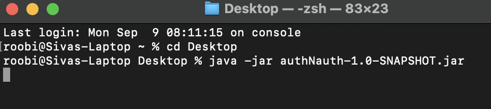
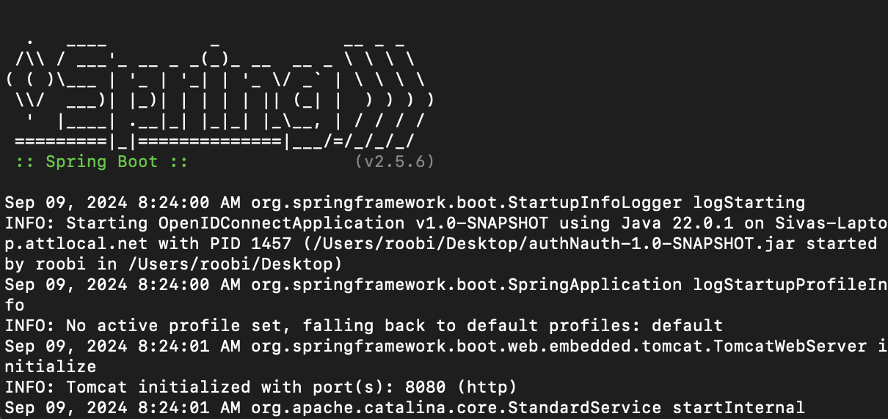
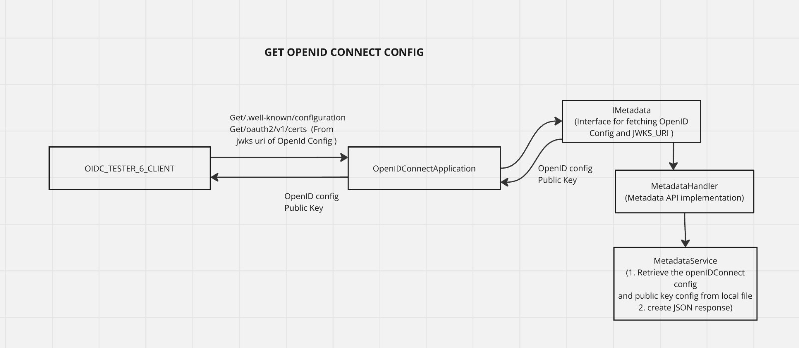
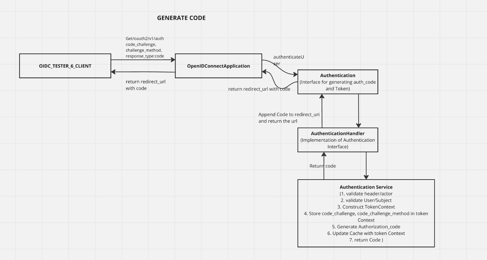
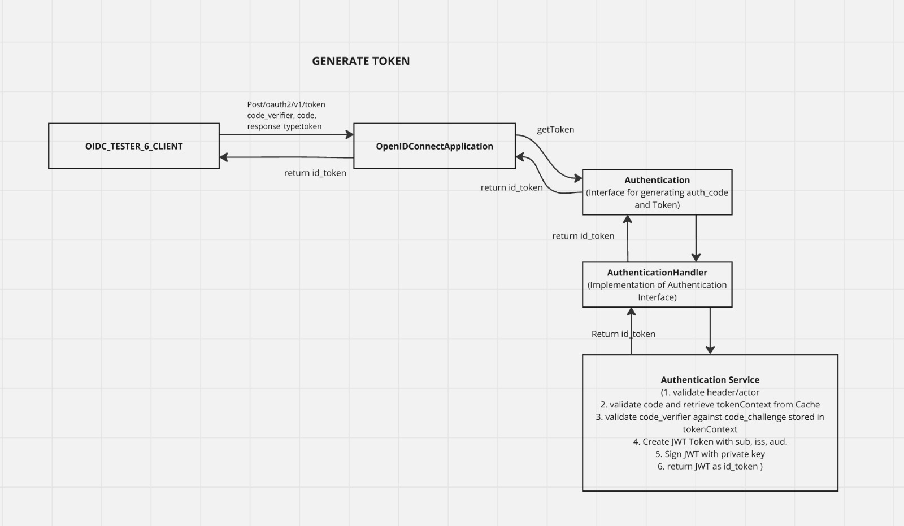

# Simple OpenID Connect application

This is a simple OpenID Connect Application to support SSO login with PKCE.

This OpenId Connect Application exposes 4 APIs

1. ./well-known/openid-configuration - return OpendID Discovery Doc
2. oauth2/v1/certs - returns the public Key 
3. oauth2/v1/auth - return the authorization code
4. oauth2/v1/token - returns the id_token after PKCE validation

## Configuration

You need to open the terminal and go to the location of the JAR file
shared and run the following command to start the OpenIdConnect Application

| java -jar authNauth-1.0-SNAPSHOT.jar  |
|---                                    |

You can now run the OIDC Tester Application via Docker on port 3000 and
test the SSO flow.

## High Level Architecture
The diagram shows flow of how I implemented the OpenID Connect SSO flow

## Assumptions and Limitations

1. I have setup a mock user(Hardcoded credentials) and used that for authentication purpose
2. I am not doing any processing on the scope parameter. Ideally the scope should be evaluated
   and associated to the id_token.
3. I have setup a cache time limit of 15 mins. Ideally the token context expiry time 
   should be used to check if the token is expired. 